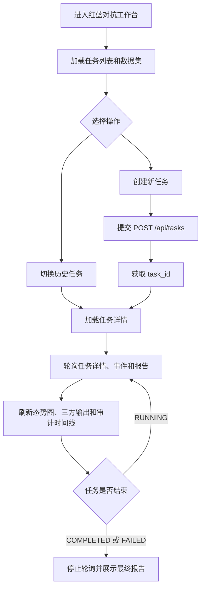

## 1. 产品概述

红蓝对抗平台前端是面向 AI Agent 安全评测的可视化控制台，用于创建评测任务、观察红蓝对抗过程、查看三方输出、审计事件和安全报告。
- 主要服务课程实训、平台演示和安全评测复盘场景，解决后端数据难以直观展示的问题。
- 前端严格基于现有后端接口实现，优先保证任务配置、态势展示、评分报告和审计证据链完整可读。

## 2. 核心功能

### 2.1 用户角色

当前阶段不区分登录用户和权限角色，默认使用者为平台操作员。

| 角色 | 使用方式 | 核心权限 |
|------|----------|----------|
| 平台操作员 | 本地访问前端页面 | 创建任务、切换任务、查看对抗态势、查看报告和审计日志 |

### 2.2 功能模块

1. **左侧控制台**：侧边栏收缩、任务快速切换、当前任务参数只读展示、创建新任务入口。
2. **任务大盘**：展示任务标题、任务 ID、状态、创建时间、更新时间和风险矩阵版本。
3. **对抗态势图**：横向展示红方发起、输入检测、目标执行、工具审计、输出检测和报告生成阶段。
4. **三方输出查看器**：使用标签页展示红方攻击载荷、被测智能体输出和蓝方审计判定。
5. **安全洞察区**：展示指标卡片、风险覆盖、风险拆解、总结和整改建议。
6. **审计时间线**：展示 audit_events 事件流，作为报告与态势图的数据支撑。

### 2.3 页面详情

| 页面名称 | 模块名称 | 功能描述 |
|----------|----------|----------|
| 工作台页面 | Left Sidebar | 支持 300px 展开和 48px 收起，展示任务列表、任务参数和创建任务入口 |
| 工作台页面 | Main Header | 展示 `[Task] ASI-2026 红蓝对抗演练 #{task_id}`、状态 Badge、创建时间、更新时间、风险矩阵版本 |
| 工作台页面 | Action Graph | 从 audit_events 推导当前阶段，使用 allow、block、degrade 控制节点和连线颜色 |
| 工作台页面 | Data Viewer | Tab 1 展示 attack_cases，Tab 2 组装 TARGET_EXECUTED、TOOL_CALLED、raw_output.target_output，Tab 3 展示 detection_results |
| 工作台页面 | Security Insights | 展示 total_attacks、attack_success_rate、detection_rate、block_rate、false_positive_rate、false_negative_rate、risk_coverage、risk_breakdown、summary、recommendations |
| 工作台页面 | Audit Timeline | 按时间顺序展示 ATTACK_REQUESTED、INPUT_DETECTED、TARGET_EXECUTED、TOOL_ALLOWED、TOOL_BLOCKED、TOOL_DEGRADED、TOOL_CALLED、OUTPUT_ALLOWED、OUTPUT_BLOCKED、REDTEAM_EVOLVED、EVALUATION_METRIC、REPORT_EVENT |
| 创建任务面板 | 参数表单 | 填写 target_agent、risk_types、attack_count、max_rounds、use_llm、redbench_datasets、matrix_version，并提交 POST /api/tasks |

## 3. 核心流程

用户进入工作台后，前端加载任务列表和 RedBench 数据集；用户可以选择历史任务查看详情，也可以创建新任务。创建任务后，前端拿到 task_id，并通过轮询任务详情、事件和报告接口刷新页面。任务结束后停止轮询，展示完整报告和审计证据链。

## 4. 用户界面设计

### 4.1 设计风格

- 主色：GitHub 风格浅色体系，页面背景 `#f6f8fa`，模块背景 `#ffffff`。
- 边框：使用 `1px solid #d0d7de`，模块圆角 `6px`，不使用厚重阴影。
- 状态色：成功 `#1a7f37`，失败 `#cf222e`，警告 `#9a6700`，强调蓝 `#0969da`。
- 字体：标题和正文使用系统默认无衬线字体；ID、日志、JSON 和模型输出使用 Consolas 或 JetBrains Mono。
- 布局：Flexbox 横向主布局，左侧可伸缩侧边栏，右侧为一站式纵向滚动工作台。
- 交互：当前阶段节点使用蓝色轻微闪烁；审计日志右侧 sticky；数据查看区局部滚动。
- 图标：优先使用 Element Plus 图标或 SVG，不使用 emoji 作为主要视觉符号。

### 4.2 页面设计概览

| 页面名称 | 模块名称 | UI 元素 |
|----------|----------|---------|
| 工作台页面 | Left Sidebar | 汉堡按钮、任务选择器、状态圆点、参数标签、只读配置字段、创建任务按钮 |
| 工作台页面 | Main Header | 大标题、状态 Badge、Meta 信息行、矩阵版本标签 |
| 工作台页面 | Action Graph | 横向节点、状态连线、当前节点闪烁、allow/block/degrade 色彩映射 |
| 工作台页面 | Data Viewer | Underline Tabs、深色代码区、JSON 高亮、局部滚动 |
| 工作台页面 | Security Insights | 指标卡片、ECharts 图表、Markdown 总结、整改建议 |
| 工作台页面 | Audit Timeline | 垂直时间线、事件类型标签、Agent 信息、工具名、风险等级、消息内容 |

### 4.3 响应式

- 桌面优先，默认适配 1366px 及以上屏幕。
- 1024px 以下时，左侧侧边栏默认收起，Insights 与 Timeline 改为上下排列。
- 768px 以下时，Action Graph 允许横向滚动，三方输出区保持标签页结构。

### 4.4 3D 场景指导

本项目不包含 3D 场景。