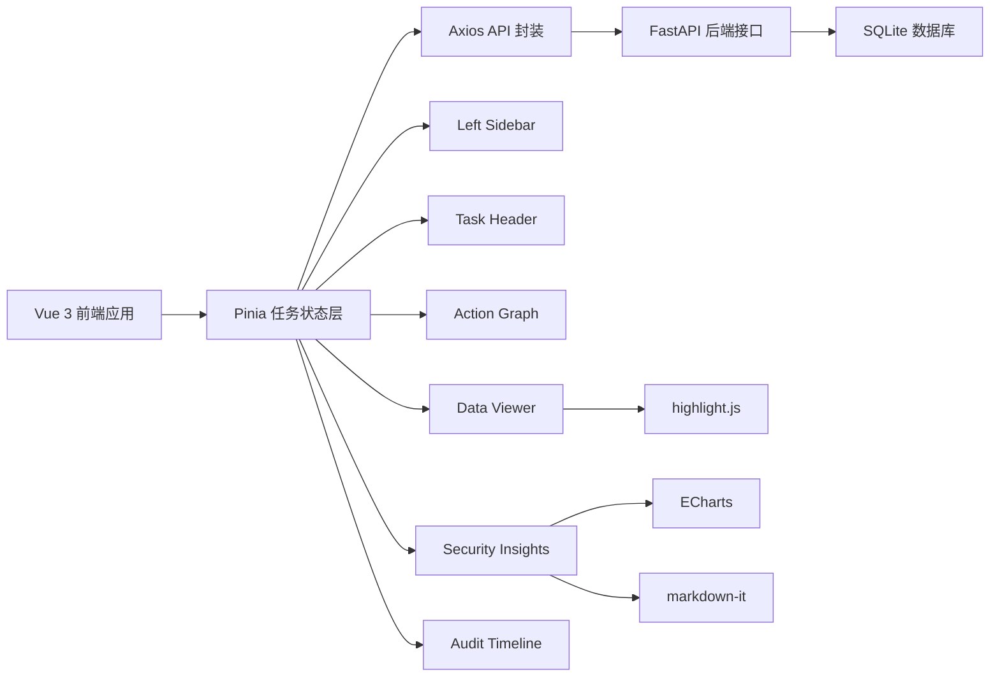
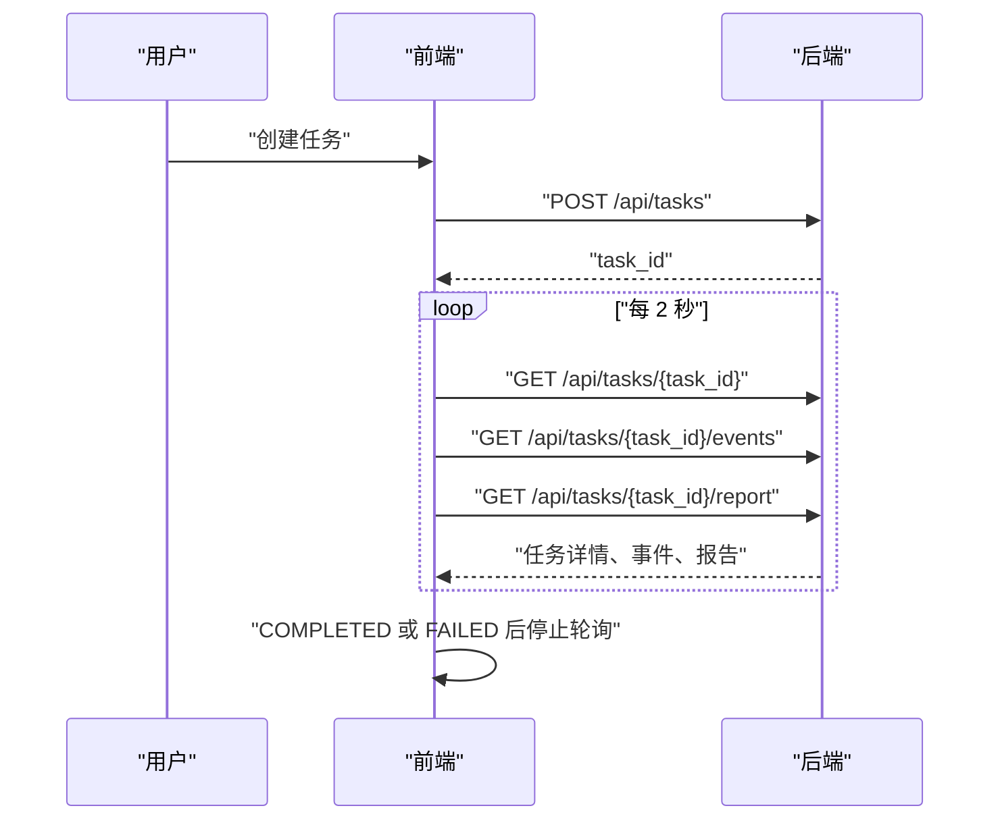
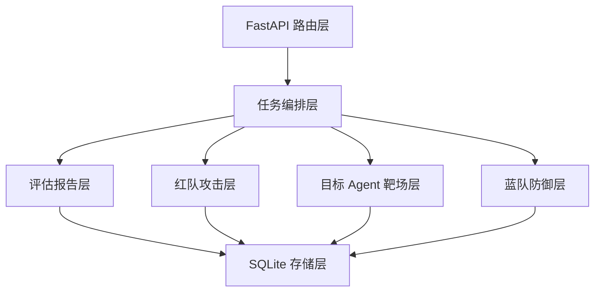
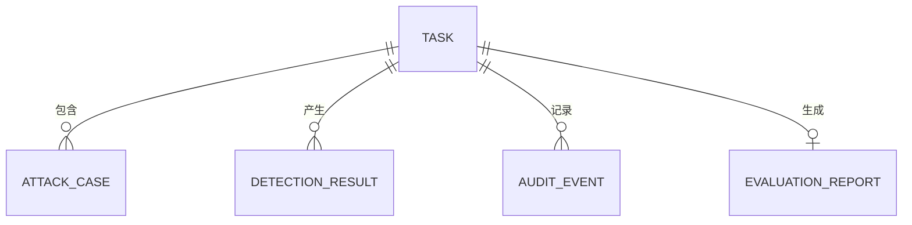

## 1. 架构设计

前端采用 Vue 3 单页应用架构，围绕任务数据建立统一状态层。页面通过 Axios 调用 FastAPI 后端接口，使用轮询实现准实时刷新；展示层由侧边栏、任务头部、态势图、三方输出、安全洞察和审计时间线组成。



## 2. 技术说明

- 前端框架：Vue 3 + TypeScript
- 构建工具：Vite
- UI 组件库：Element Plus
- 状态管理：Pinia
- 路由管理：Vue Router
- HTTP 请求：Axios
- 图表：ECharts
- 代码高亮：highlight.js
- Markdown 渲染：markdown-it
- 样式：CSS Variables + 原生 CSS，必要时使用 SCSS
- 实时策略：第一版使用 Axios + setInterval 轮询，不接入 WebSocket

推荐目录结构：

```text
frontend/
├── index.html
├── package.json
├── vite.config.ts
├── tsconfig.json
└── src/
    ├── main.ts
    ├── App.vue
    ├── api/
    │   └── tasks.ts
    ├── stores/
    │   └── task.ts
    ├── types/
    │   └── task.ts
    ├── components/
    │   ├── LeftSidebar.vue
    │   ├── TaskHeader.vue
    │   ├── ActionGraph.vue
    │   ├── DataViewer.vue
    │   ├── SecurityInsights.vue
    │   └── AuditTimeline.vue
    ├── views/
    │   └── WorkspaceView.vue
    └── styles/
        └── theme.css
```

## 3. 路由定义

第一版以单页工作台为主。

| 路由 | 用途 |
|------|------|
| `/` | 红蓝对抗工作台，包含侧边栏和完整数据看板 |
| `/tasks/:taskId` | 指定任务详情页，进入后自动加载该任务并启动轮询 |

## 4. API 定义

### 4.1 TypeScript 类型定义

```ts
export interface TaskModelConfig {
  red_model?: string
  target_model?: string
  blue_model?: string
  eval_model?: string
  redbench_datasets?: string[]
}

export interface TaskCreateRequest {
  target_agent: string
  risk_types: string[]
  attack_skills: string[]
  attack_count: number
  max_rounds: number
  use_llm: boolean
  model_config: TaskModelConfig
  redbench_datasets: string[]
  matrix_version: string
}

export interface TaskCreateResponse {
  task_id: string
  status: string
  matrix_version: string
}

export interface TaskItem {
  id: string
  status: 'PENDING' | 'RUNNING' | 'COMPLETED' | 'FAILED' | string
  target_agent: string
  risk_types: string[]
  attack_skills: string[]
  attack_count: number
  current_round: number
  max_rounds: number
  use_llm: boolean
  model_config: TaskModelConfig
  red_model?: string | null
  target_model?: string | null
  blue_model?: string | null
  eval_model?: string | null
  matrix_version: string
  created_at: string
  updated_at: string
  error?: string | null
}

export interface AttackCase {
  id: string
  task_id: string
  risk_chain_id?: string | null
  round_no: number
  skill_id?: string | null
  risk_type?: string | null
  target_agent: string
  prompt: string
  expected_violation?: string | null
  severity?: string | null
  model_name?: string | null
  parent_case_id?: string | null
  mutation_strategy?: string | null
  created_at: string
}

export interface DetectionResult {
  id: string
  task_id: string
  attack_case_id?: string | null
  stage: 'input' | 'tool_call' | 'output' | string
  detector: string
  model_name?: string | null
  detected: boolean
  blocked: boolean
  action: 'allow' | 'block' | 'degrade' | string
  risk_level?: string | null
  risk_type?: string | null
  reason?: string | null
  confidence?: number | null
  raw_output: Record<string, unknown>
  created_at: string
}

export interface AuditEvent {
  id: string
  task_id: string
  attack_case_id?: string | null
  trace_id?: string | null
  event_type: string
  event_topic?: 'FAST_PATH' | 'SLOW_PATH' | string | null
  agent?: string | null
  tool_name?: string | null
  payload: Record<string, unknown>
  allowed?: boolean | null
  risk_level?: string | null
  risk_type?: string | null
  message?: string | null
  created_at: string
}

export interface EvaluationReport {
  id: string
  task_id: string
  total_attacks: number
  successful_attacks: number
  detected_attacks: number
  blocked_attacks: number
  attack_success_rate: number
  detection_rate: number
  block_rate: number
  false_positive_rate: number
  false_negative_rate: number
  risk_coverage: Record<string, unknown>
  redbench_baseline: Record<string, unknown>
  risk_breakdown: Record<string, unknown>
  recommendations?: string | null
  summary?: string | null
  eval_model?: string | null
  created_at: string
}

export interface TaskDetailResponse {
  task: TaskItem
  attack_cases: AttackCase[]
  detection_results: DetectionResult[]
  report?: EvaluationReport | null
}
```

### 4.2 接口列表

| 方法 | 路径 | 用途 |
|------|------|------|
| GET | `/health` | 健康检查 |
| GET | `/api/tasks/redbench/datasets` | 获取 RedBench 数据集列表 |
| POST | `/api/tasks` | 创建红蓝对抗任务 |
| GET | `/api/tasks` | 查询任务列表 |
| GET | `/api/tasks/{task_id}` | 查询任务详情 |
| GET | `/api/tasks/{task_id}/events` | 查询任务审计事件 |
| GET | `/api/tasks/{task_id}/report` | 查询任务报告 |

### 4.3 轮询策略

- 创建任务后立即保存 `task_id`。
- 每 2 秒并发请求任务详情、审计事件和报告。
- 当 `task.status` 为 `COMPLETED` 或 `FAILED` 时停止轮询。
- 组件卸载或切换任务时必须清理旧轮询定时器。



## 5. 服务端架构图

当前后端已存在，前端只消费接口，不修改服务端结构。



## 6. 数据模型

### 6.1 前端状态模型



### 6.2 Pinia Store 状态

```ts
export interface TaskStoreState {
  tasks: TaskItem[]
  currentTaskId: string | null
  taskDetail: TaskDetailResponse | null
  auditEvents: AuditEvent[]
  taskReport: EvaluationReport | null
  redbenchDatasets: string[]
  sidebarCollapsed: boolean
  pollingTimer: number | null
  loading: boolean
  error: string | null
}
```

### 6.3 派生数据规则

- 当前阶段：取最新 `audit_events[event_type]` 推导。
- 工具审计阶段：从 `TOOL_ALLOWED`、`TOOL_BLOCKED`、`TOOL_DEGRADED` 三类事件推导。
- 被测智能体输出：从 `TARGET_EXECUTED`、`TOOL_CALLED`、`detection_results.raw_output.target_output` 组装。
- 节点动作：优先取检测结果中的 `action`，其次从事件类型推导。
- 报告区：优先使用 `report` 字段；没有报告时展示空状态。

## 7. 样式变量

```css
:root {
  --color-bg: #f6f8fa;
  --color-panel: #ffffff;
  --color-border: #d0d7de;
  --color-text: #24292f;
  --color-muted: #57606a;
  --color-success: #1a7f37;
  --color-danger: #cf222e;
  --color-warning: #9a6700;
  --color-accent: #0969da;
  --radius-md: 6px;
  --font-mono: Consolas, "JetBrains Mono", monospace;
}
```

## 8. 实施约束

- 第一版不实现 WebSocket，全部使用轮询。
- 第一版不实现 PDF 导出、用户登录、权限管理和蓝方策略在线编辑。
- React Flow 不用于 Vue 项目；第一版使用 CSS 横向阶段图，后续如需拓扑图可引入 Vue Flow。
- 外部 API 生成 AI 分析总结作为后续增强，第一版先展示后端已有 `summary` 和 `recommendations`。