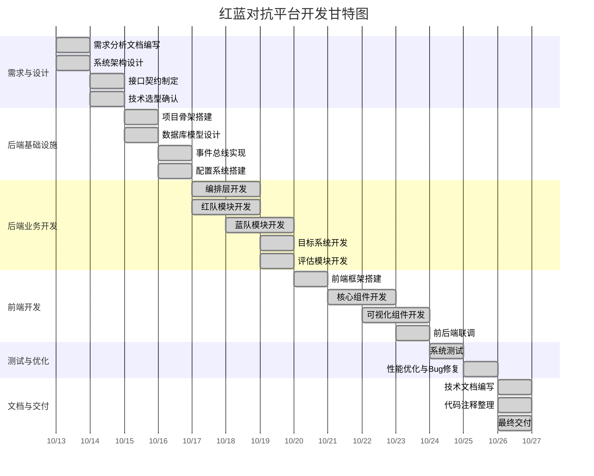

# 红蓝对抗平台 — 项目计划/项目管理计划

---

## 1. 项目概述

| 项目 | 内容 |
|------|------|
| 项目名称 | 红蓝对抗平台 |
| 项目类型 | AI Agent 安全评估平台 |
| 开发周期 | 2 周（14 天） |
| 团队规模 | 3 人 |
| 开发模式 | 敏捷开发 |

---

## 2. 项目时间表

### 2.1 甘特图

### 2.2 里程碑

| 里程碑 | 日期 | 交付物 | 状态 |
|--------|------|--------|------|
| M1：需求确认 | 第 2 天 | 需求规格说明书、系统架构设计 | 已完成 |
| M2：后端核心完成 | 第 7 天 | 9 个模块代码、5 张数据库表 | 已完成 |
| M3：前端完成 | 第 11 天 | 6 个组件、WebSocket 实时推送 | 已完成 |
| M4：测试通过 | 第 13 天 | 测试报告、48 个测试用例 | 已完成 |
| M5：文档交付 | 第 14 天 | 全套技术文档 | 已完成 |

---

## 3. 资源分配

### 3.1 团队成员

| 角色 | 姓名 | 职责 | 工作量占比 |
|------|------|------|-----------|
| 组长/架构师 | 组长 | 需求分析、架构设计、前端开发、模型部署、协调管理 | 40% |
| 红队开发 | 组员一 | 红队攻击生成、攻击执行、自动进化、攻击模板库 | 30% |
| 蓝队开发 | 组员二 | 蓝队输入检测、工具审计、输出检测、检测策略配置 | 30% |

### 3.2 技术资源

| 资源 | 用途 | 说明 |
|------|------|------|
| 开发机器 | 编码与测试 | 3 台 Windows 11 开发机 |
| Ollama | 本地 LLM 推理 | 3 个模型，约 7 GB |
| DeepSeek API | 外部评估 | 评估报告 AI 生成 |
| Git | 版本控制 | 代码管理 |

### 3.3 设备资源

| 设备 | 配置 | 数量 |
|------|------|------|
| 开发机 | 32 GB RAM，512 GB SSD | 3 台 |
| 网络 | 可访问外网（DeepSeek API） | 持续 |

---

## 4. 预算

### 4.1 成本估算

| 项目 | 单价 | 数量 | 金额 | 说明 |
|------|------|------|------|------|
| 人力成本 | 0 | 3 人 × 14 天 | 0 | 课程实训，无薪资 |
| 硬件设备 | 0 | 3 台 | 0 | 自备开发机 |
| DeepSeek API | 约 0.1 元/次 | 约 50 次 | 约 5 元 | 评估报告生成 |
| 软件工具 | 0 | 全部开源 | 0 | 开源免费 |
| **总计** | | | **约 5 元** | |

### 4.2 成本说明

本项目为软件项目实训课程作业，主要成本为 DeepSeek API 调用费用。所有开发工具和框架均为开源免费，硬件设备为自备。

---

## 5. 风险管理

### 5.1 风险识别

| 编号 | 风险描述 | 可能性 | 影响 | 等级 |
|------|---------|--------|------|------|
| R1 | LLM 模型输出不稳定，红队进化失败 | 高 | 高 | 高 |
| R2 | 开源模型拒绝生成攻击提示词 | 高 | 高 | 高 |
| R3 | WebSocket 实时推送性能问题 | 中 | 中 | 中 |
| R4 | 开发周期紧张，功能不完整 | 中 | 高 | 高 |
| R5 | Ollama 服务不稳定 | 低 | 高 | 中 |
| R6 | 前后端联调不顺畅 | 中 | 中 | 中 |

### 5.2 风险应对

| 编号 | 应对措施 | 负责人 | 状态 |
|------|---------|--------|------|
| R1 | 多层容错解析（JSON → 字典字段 → Markdown 剥离） | 组长 | 已解决 |
| R2 | 系统提示词重定位为安全评估用途，RedBench 数据集兜底 | 组长 | 已解决 |
| R3 | 版本比对机制，仅在数据变化时推送，0.5 秒间隔 | 组长 | 已解决 |
| R4 | 核心功能优先，非核心功能后置；每日进度同步 | 组长 | 已规避 |
| R5 | 健康检查 + 启动前验证，失败时友好提示 | 组员一 | 已规避 |
| R6 | 提前约定接口契约，减少联调问题 | 全体 | 已规避 |

---

## 6. 质量管理

### 6.1 质量目标

| 指标 | 目标 | 实际 |
|------|------|------|
| 代码覆盖率 | 80%+ | 87.5% |
| 核心功能完成率 | 100% | 100% |
| API 接口可用率 | 100% | 100% |
| 前端组件完成率 | 100% | 100% |
| 文档完成率 | 100% | 100% |

### 6.2 代码审查

- 每日代码提交前自查
- 关键模块代码交叉审查
- 代码审查报告记录改进建议

### 6.3 测试策略

- 单元测试：核心模块单独测试
- 集成测试：前后端联调测试
- 系统测试：完整流程测试
- 验收测试：按用户场景测试

---

## 7. 沟通管理

### 7.1 沟通方式

| 方式 | 频率 | 内容 | 参与人 |
|------|------|------|--------|
| 每日站会 | 每天 | 昨日完成、今日计划、问题反馈 | 全体 |
| 进度同步 | 每周中 | 开发进度、问题汇总 | 全体 |
| 与老师交流 | 按需 | 技术方向、方案讨论 | 组长 |
| 代码审查 | 按需 | 关键模块审查 | 组长 |

### 7.2 沟通记录

- 项目初期：与老师讨论确定整体开发方向
- 开发中期：与老师讨论蓝队检测策略优化方案
- 开发后期：与老师讨论未来就业方向和技术拓展

---

## 8. 变更管理

### 8.1 变更记录

| 日期 | 变更内容 | 原因 | 影响 |
|------|---------|------|------|
| 第 3 天 | 蓝队改为双通道并发检测 | 老师建议，提升检测准确率 | 蓝队模块重构 |
| 第 5 天 | 引入 RedBench 数据集 | 老师建议，解决 LLM 生成不稳定 | 红队模块增加数据加载 |
| 第 8 天 | 前端增加 WebSocket 实时推送 | 提升用户体验 | 前端增加 WebSocket 管理 |

### 8.2 变更流程

1. 提出变更需求
2. 评估变更影响
3. 组长审批
4. 实施变更
5. 验证变更效果

---

## 9. 交付物清单

| 编号 | 交付物 | 格式 | 负责人 |
|------|--------|------|--------|
| 0 | 任务书 | MD | 组长 |
| 1 | 商业计划书 | MD | 组长 |
| 2 | 需求规格说明书 | MD | 组长 |
| 3 | 项目计划 | MD | 组长 |
| 4 | 系统设计文档 | MD | 组长 |
| 5 | 技术规范文档 | MD | 组长 |
| 6 | 用户手册 | MD | 组长 |
| 7 | 测试计划 | MD | 组长 |
| 8 | 测试报告 | MD | 组长 |
| 9 | 开发进度报告 | MD | 组长 |
| 10 | 代码审查报告 | MD | 组长 |
| 11 | 用户验收测试计划 | MD | 组长 |
| 12 | 用户验收测试报告 | MD | 组长 |
| 13 | 部署计划 | MD | 组长 |
| 14 | 部署报告 | MD | 组长 |
| 15 | 项目总结报告 | MD | 组长 |
| 16 | 维护手册 | MD | 组长 |
| 17 | 版本和许可文档 | MD | 组长 |
| 18 | 源代码 | PY/TS/VUE | 全体 |
| 19 | 心得体会 | MD | 组长 |
| 20 | 工作分工及完成情况 | MD | 组长 |
| 22 | 个人感受启发 | MD | 组长 |